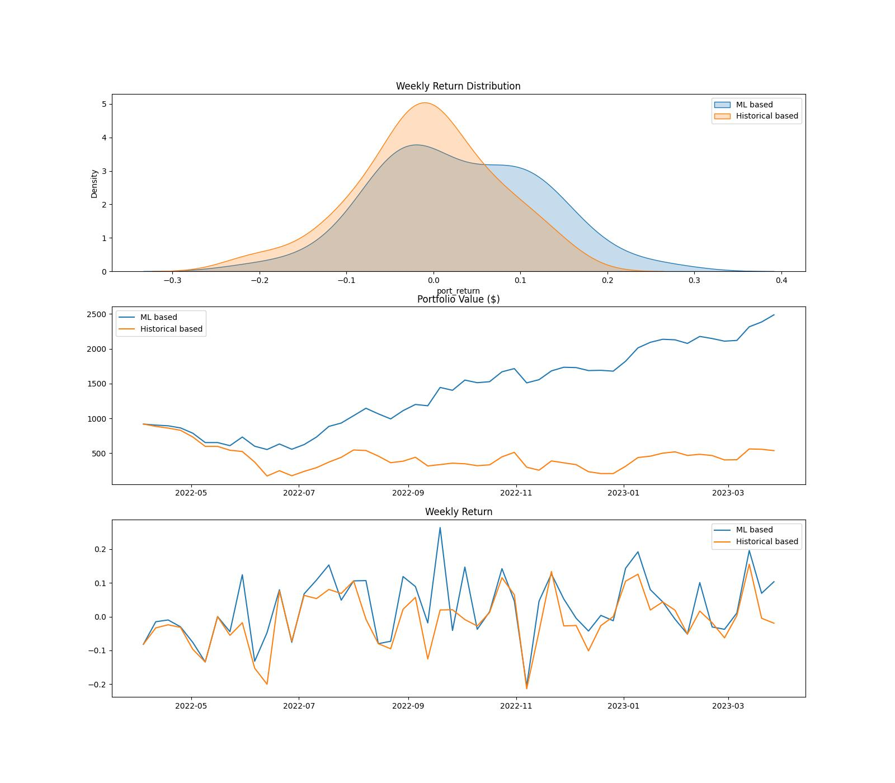

# Background & Objectives

## Background

Modern Portfolio Theory (MPT, Markowitz 1950) is a famous investment theory where the idea of portfolio construction relies on optimizing the trade-off between expected return and risk. By diversifying the assets within the portfolio, we can essentially reduce the risk of our portfolio (depending on accross asset's covariance & correlation). While the idea of MPT is very appealing, it needs both expected return & expected risk to be estimated accurately, which is a non-trivial task (traditionally, most just use assets historical return & risk).

## Objectives

On this exercise, we'll focus on exploring how ML/DL can help measuring expected return more accurately & increase weights allocation efficiency. 

We'll implement this on Top 5 coins in cryptocurrency market (BTC, ETH, XRP, BNB, ADA) where naturally the market is more volatile, hence measuring accurate expected return is relatively more important than other market(s). 

Bullet points objectives;
- To leverage ML/DL to estimate expected return (keep expected risk estimation with historical method)
- To allocate weights optimally that maximizes sharpe ratio
- To do performance comparison between Ml based vs Historical based portfolio

## Findings

### Key Insights:

- Historical based portfolio has central tendancy near 0 & slightly left-skewed. While the ML based portfolio has right-skewed ditribution. This indicates that the **weekly return of Ml based has more positive & higher return**.
- Portfolio value of both Ml based & Historical based started at similar level. However, somewhere around 2022-06, Ml based starts to outperform Historical based. Seeing at the details of the weight allocation, **Ml based has more optimal allocation** since some of the coins has started on bullish trend (invest more on positive expected return)

## Conclusion

- We did found that **ML-based portfolio has far outperformed the historical-based portfolio** (along with other strategies such as equal-weighted & individual coins only)
- Main reason why it outperformed the baseline is because the **ML-based can estimate expected return of each coins quite accurately**. It is **very useful on the period where there is low covariance or correlation between assets** (period where some coins performed better than others)

